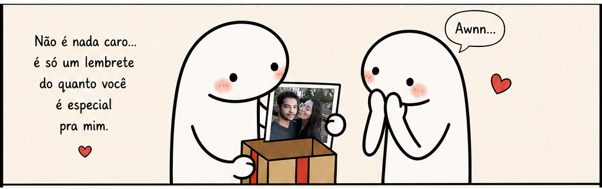
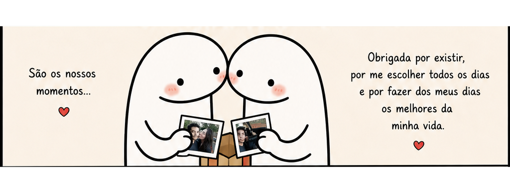
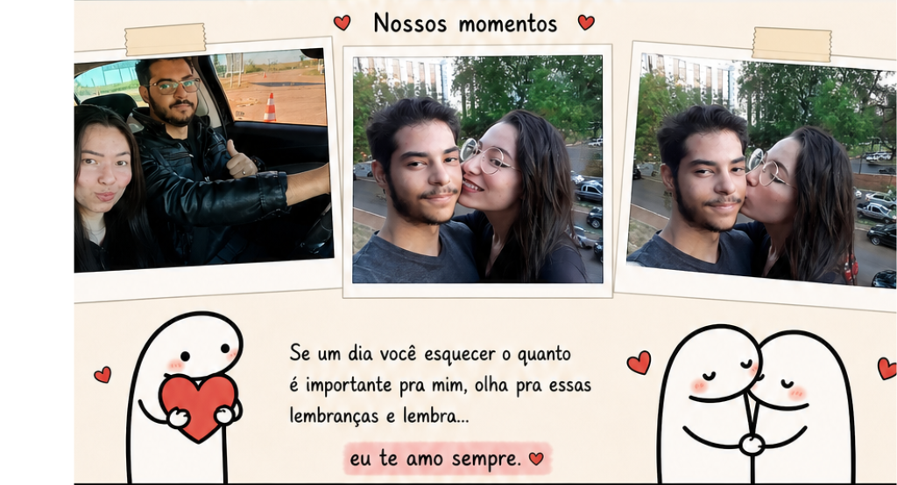

<html lang="pt-BR">
<head>
<meta charset="UTF-8">
<meta name="viewport" content="width=device-width, initial-scale=1.0">

<title>Só pra te lembrar ❤️</title>

<link rel="preconnect" href="https://fonts.googleapis.com">
<link href="https://fonts.googleapis.com/css2?family=Patrick+Hand&display=swap" rel="stylesheet">

</head>

<body>

<!-- LOADING -->

    <h1>❤️ Carregando amor... ❤️</h1>
    
Preparando uma surpresa especial ✨

<!-- ESTRELAS -->

<!-- CORAÇÕES -->

<!-- TOPO -->
<section class="hero">

    <h1>Só pra te lembrar ❤️</h1>

    

        Que independente do tempo,
        dos problemas ou da correria...
        você continua sendo uma das melhores partes da minha vida.
    

    

    

        ↓ role para continuar ↓
    

</section>

<!-- HISTÓRIA -->

    

        
    

    

        
    

    

        
    

    

        
    

<!-- FINAL -->
<section class="final">

    <h1>❤️ Eu te amo ❤️</h1>

    

        Obrigado por existir. 
        Obrigado por cada abraço, 
        cada risada, 
        cada momento nosso. ✨
    

</section>

<!-- BOTÕES -->

    <button class="btn" onclick="toggleMusic()">
        🎵
    </button>

    <button class="btn" onclick="window.scrollTo({top:0,behavior:'smooth'})">
        ⬆
    </button>

<!-- MÚSICA -->
<audio id="music" loop>
    <source src="musica.mp3" type="audio/mp3">
</audio>

</body>
</html>
